# 🏗️ 시스템 아키텍처

## 📊 전체 시스템 구조

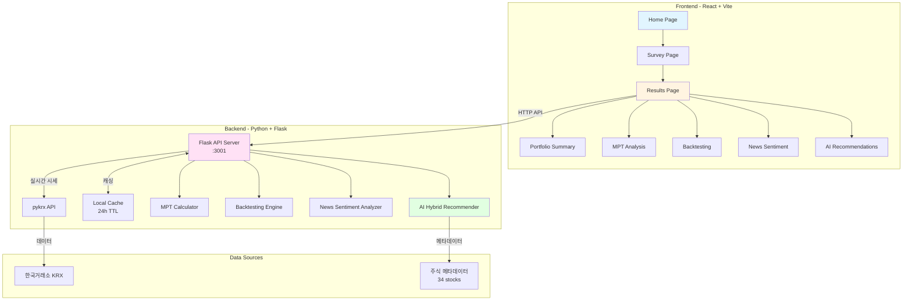

---

## 🤖 AI 하이브리드 추천 시스템

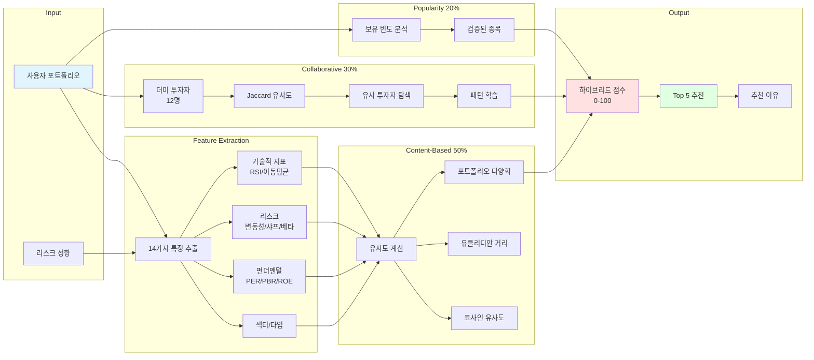

---

## 📊 MPT (Modern Portfolio Theory) 플로우

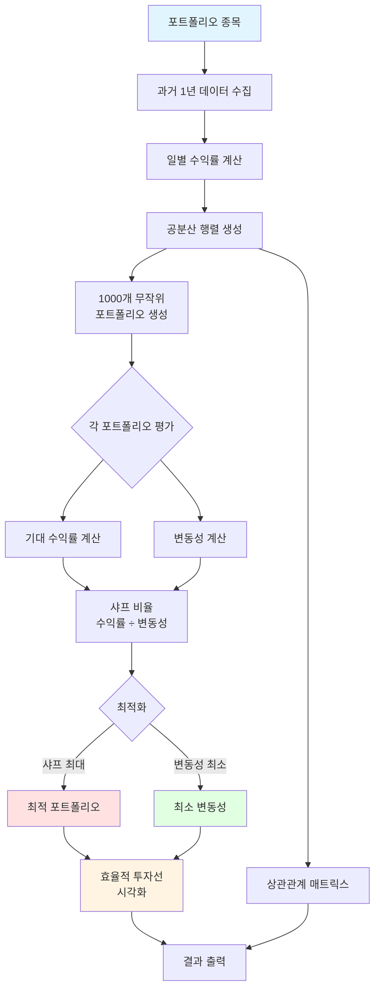

---

## 🔄 백테스팅 프로세스

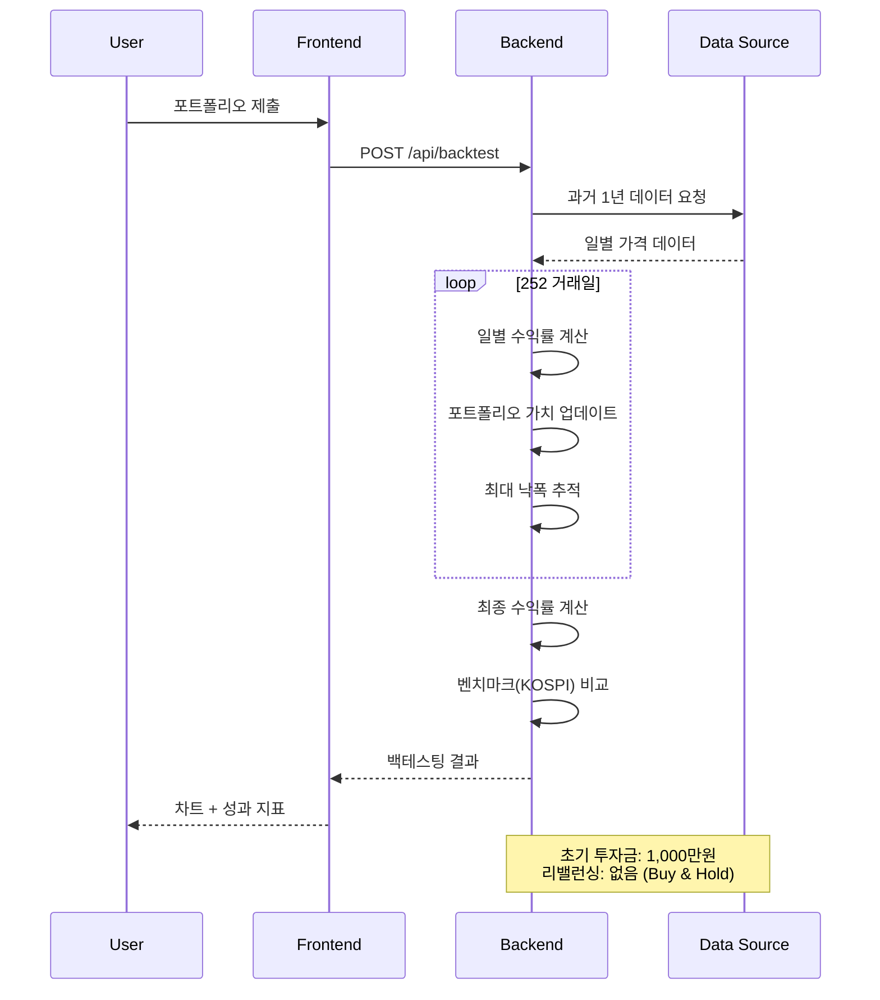

---

## 📰 뉴스 감성 분석 파이프라인

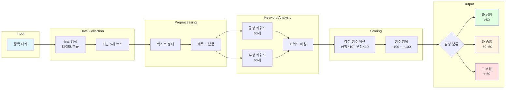

---

## 🗄️ 데이터 플로우

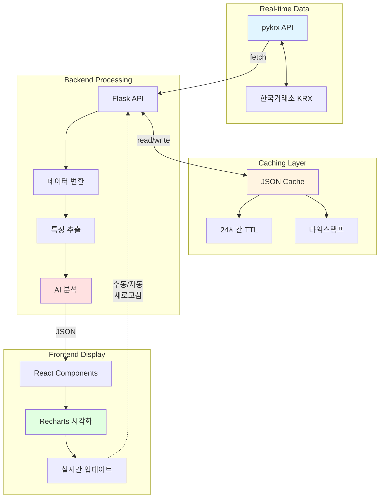

---

## 🎨 컴포넌트 구조

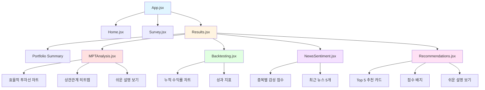

---

## 🔐 API 엔드포인트 맵

```mermaid
graph LR
    A[Frontend<br/>:5173] -->|GET| B[/api/stocks]
    A -->|POST| C[/api/mpt/analyze]
    A -->|POST| D[/api/backtest]
    A -->|POST| E[/api/news/sentiment]
    A -->|POST| F[/api/recommendations/hybrid]
    A -->|GET| G[/api/cache/status]
    A -->|DELETE| H[/api/cache/clear]

    subgraph "Backend API :3001"
        B
        C
        D
        E
        F
        G
        H
    end

    B --> I[주식 시세]
    C --> J[MPT 분석]
    D --> K[백테스팅]
    E --> L[뉴스 감성]
    F --> M[AI 추천]
    G --> N[캐시 상태]
    H --> O[캐시 삭제]

    style A fill:#e1f5ff
    style F fill:#ffe1e1
```

---

## 🧠 AI 특징 벡터 구조

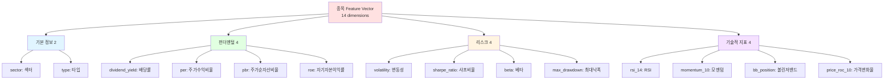

---

## 📈 사용자 여정 (User Journey)

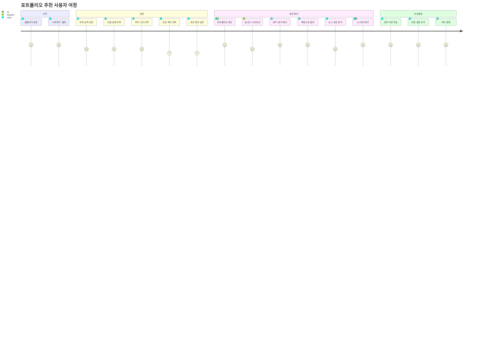

---

## 🎯 성능 최적화 전략

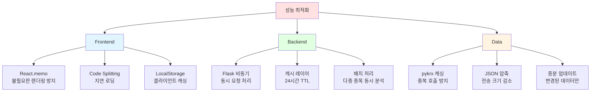

---

## 🔄 개발 워크플로우

```mermaid
gitgraph
    commit id: "Initial MVP"
    branch feature/mpt
    checkout feature/mpt
    commit id: "MPT Calculator"
    commit id: "MPT Frontend"
    checkout main
    merge feature/mpt

    branch feature/backtest
    checkout feature/backtest
    commit id: "Backtest Engine"
    commit id: "Backtest UI"
    checkout main
    merge feature/backtest

    branch feature/news
    checkout feature/news
    commit id: "News Sentiment"
    commit id: "News UI"
    checkout main
    merge feature/news

    branch feature/ai-recommendation
    checkout feature/ai-recommendation
    commit id: "Feature Extraction"
    commit id: "Content-Based"
    commit id: "Collaborative Filtering"
    commit id: "Hybrid System"
    commit id: "AI UI Components"
    checkout main
    merge feature/ai-recommendation tag: "v1.0"
```

---

## 📊 시스템 메트릭

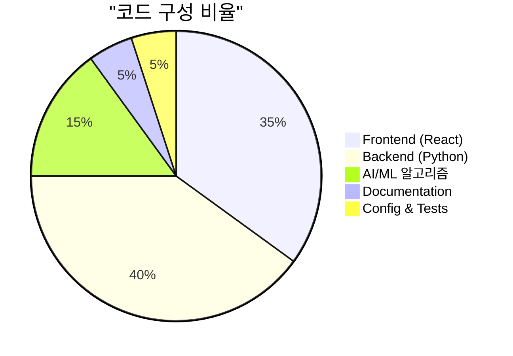

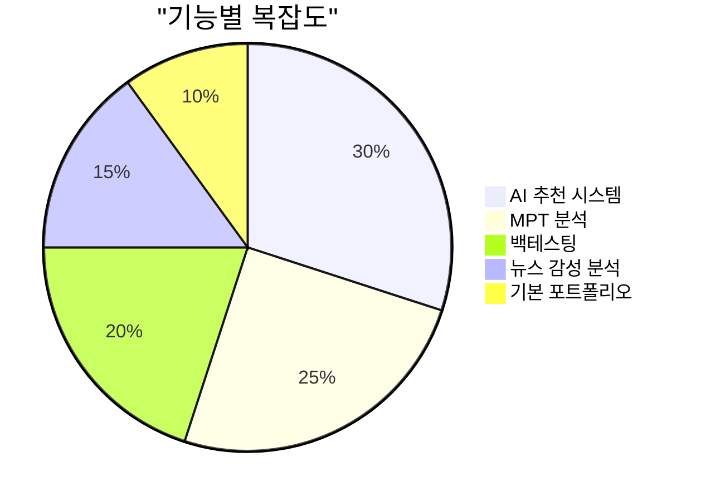

---

## 🚀 배포 아키텍처 (향후 계획)

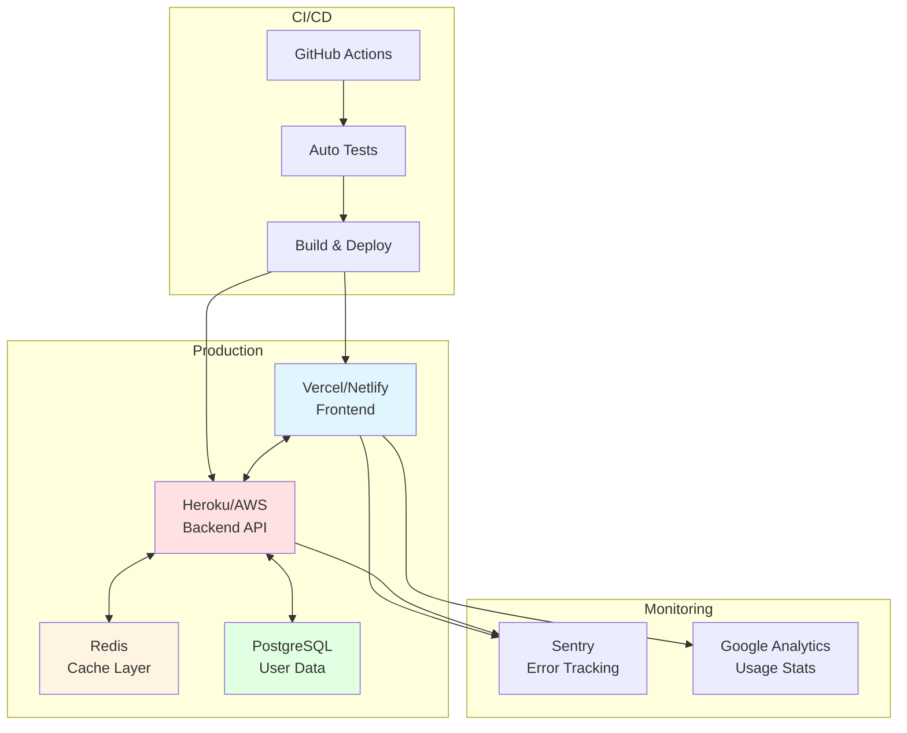

---

## 📱 반응형 디자인

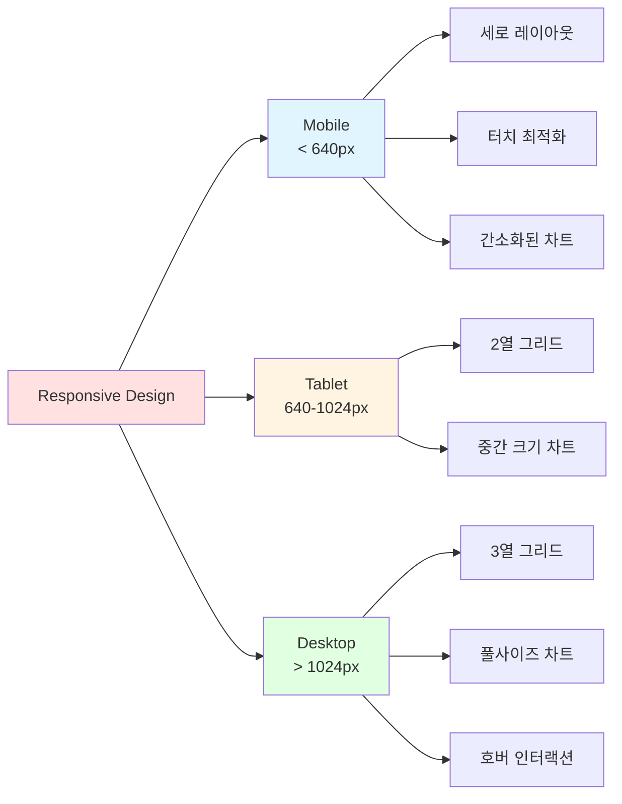
